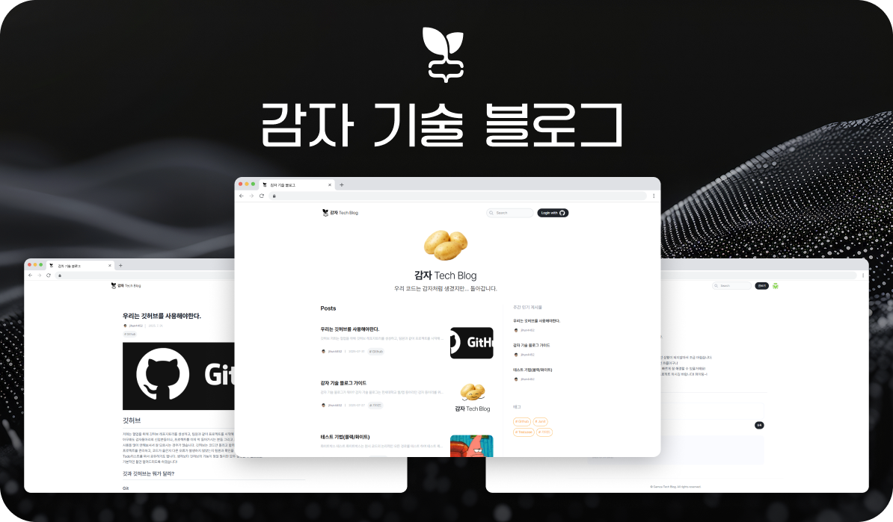

# GamzaTechBlog Frontend

<div align="center">
  
</div>

<br />

> Next.js 15 기반의 감자 테크 블로그 프론트엔드

한세대학교 IT학부 코딩 웹 동아리 "감자" 부원들을 위한 기술 블로그 플랫폼입니다. 마크다운 에디터, 실시간 댓글, 태그 기반 검색 등의 기능을 제공하며, 동아리 부원들이 기술 지식을 공유하고 소통할 수 있는 공간을 제공합니다.

## 📚 목차

- [주요 기능](#주요-기능)
- [기술 스택](#기술-스택)
- [시작하기](#시작하기)
- [프로젝트 구조](#프로젝트-구조)
- [개발 가이드](#개발-가이드)
- [API 연동](#api-연동)
- [배포](#배포)

## ✨ 주요 기능

### 📝 콘텐츠 관리
- **게시글 작성/수정**: Toast UI Editor를 활용한 마크다운 편집
- **이미지 업로드**: S3 기반 이미지 저장 및 최적화
- **좋아요 기능**: 게시글 좋아요 및 북마크

### 🔍 검색 및 탐색
- **전체 검색**: 게시글 전문 검색
- **태그 필터링**: 태그 기반 콘텐츠 탐색
- **사용자 프로필**: 작성자별 게시글 모음

### 🔐 인증 및 권한
- **JWT 인증**: 쿠키 기반 토큰 관리
- **권한 제어**: 미들웨어 기반 라우트 보호
- **관리자 시스템**: 사용자 승인 및 관리

### 🎨 사용자 경험
- **다크 모드**: 시스템 설정 연동 테마 지원
- **반응형 디자인**: 모바일/데스크톱 최적화
- **한글 타이포그래피**: Pretendard 폰트 적용
- **AI 챗봇**: 실시간 채팅 지원

## 🛠 기술 스택

### Core
- **Next.js**
- **React**
- **TypeScript**

### 상태 관리
- **TanStack Query (React Query)** - 서버 상태 관리
- **React Hook Form** - 폼 관리

### UI/UX
- **Tailwind CSS** - 유틸리티 우선 스타일링
- **shadcn/ui** - Radix UI 기반 컴포넌트
- **Toast UI Editor** - 마크다운 에디터
- **Lucide React** - 아이콘

### 데이터 검증
- **Zod** - 스키마 검증
- **@hookform/resolvers** - React Hook Form 통합

### 개발 도구
- **ESLint** - 코드 린팅 (Naver 설정)
- **Prettier** - 코드 포맷팅
- **@next/bundle-analyzer** - 번들 크기 분석
- **OpenAPI Generator** - API 클라이언트 자동 생성

## 🚀 시작하기

### 사전 요구사항

- Node.js 20.x 이상
- Yarn (권장) 또는 npm
- 백엔드 API 서버 실행 중 (선택사항)

### 설치

```bash
# 저장소 클론
git clone https://github.com/potato-club/GamzaTechBlog-front.git
cd GamzaTechBlog-front

# 의존성 설치
yarn install

# 환경 변수 설정
cp .env.local.example .env.local
# .env.local 파일을 편집하여 필요한 환경 변수 설정
```

### 환경 변수

`.env.local` 파일에 다음 환경 변수를 설정하세요:

| 변수명 | 설명 | 필수 여부 | 기본값 | 예시 |
|--------|------|-----------|--------|------|
| `NEXT_PUBLIC_API_BASE_URL` | 백엔드 API 서버 주소 | 필수 | - | `https://gamzatech.site` |
| `JWT_SECRET_KEY` | JWT 토큰 검증용 시크릿 키 (백엔드와 동일한 값 사용) | 필수 | - | `your-secret-key-here` |

**환경별 설정:**

**개발 환경 (`.env.local`)**
```env
NEXT_PUBLIC_API_BASE_URL=https://gamzatech.site
JWT_SECRET_KEY=your-secret-key
```

**프로덕션 환경**
- 배포 플랫폼의 환경 변수 설정에서 동일한 값 설정
- `JWT_SECRET_KEY`는 백엔드 서버와 반드시 동일한 값 사용

**⚠️ 보안 주의사항:**
- `JWT_SECRET_KEY`는 절대 GitHub에 커밋하지 마세요
- `.env.local` 파일은 `.gitignore`에 포함되어 있습니다
- 프로덕션 환경에서는 강력한 시크릿 키를 사용하세요

### 개발 서버 실행

```bash
# HTTP 개발 서버
yarn dev

# HTTPS 개발 서버 (로컬)
yarn dev:https:local

# HTTPS 개발 서버 (프로덕션 도메인)
yarn dev:https
```

개발 서버는 [http://localhost:3000](http://localhost:3000)에서 실행됩니다.

## 📁 프로젝트 구조

```
GamzaTechBlog-front/
├── src/
│   ├── app/                    # Next.js App Router
│   │   ├── (auth)/            # 인증 관련 페이지
│   │   ├── (content)/         # 콘텐츠 페이지
│   │   ├── (dashboard)/       # 대시보드
│   │   ├── admin/             # 관리자 페이지
│   │   ├── 403/               # 권한 오류 페이지
│   │   ├── globals.css        # 전역 스타일
│   │   ├── layout.tsx         # 루트 레이아웃
│   │   └── page.tsx           # 홈 페이지
│   ├── components/            # 공유 컴포넌트
│   │   ├── ui/               # shadcn/ui 컴포넌트
│   │   ├── shared/           # 공통 컴포넌트
│   │   └── dynamic/          # 동적 컴포넌트
│   ├── features/             # 기능별 모듈
│   │   ├── admin/           # 관리자 기능
│   │   ├── auth/            # 인증
│   │   ├── chatbot/         # AI 챗봇
│   │   ├── comments/        # 댓글
│   │   ├── intro/           # 소개 페이지
│   │   ├── posts/           # 게시글
│   │   ├── search/          # 검색
│   │   ├── tags/            # 태그
│   │   └── user/            # 사용자
│   ├── generated/            # 자동 생성 코드
│   │   └── api/             # OpenAPI 클라이언트
│   ├── hooks/                # 공유 커스텀 훅
│   ├── lib/                  # 유틸리티 라이브러리
│   ├── providers/            # Context Providers
│   ├── types/                # TypeScript 타입 정의
│   ├── constants/            # 상수
│   └── enums/                # Enum 정의
├── middleware.ts             # Next.js 미들웨어
├── next.config.ts            # Next.js 설정
├── tailwind.config.ts        # Tailwind CSS 설정
├── tsconfig.json             # TypeScript 설정
└── components.json           # shadcn/ui 설정
```

### Feature 기반 아키텍처

각 기능(`features/`)은 독립적으로 구성됩니다:

```
features/[feature-name]/
├── components/        # 기능별 컴포넌트
├── hooks/            # 기능별 커스텀 훅
├── services/         # API 서비스 레이어
├── types/            # 기능별 타입
└── index.ts          # 공개 API
```

## 💻 개발 가이드

### 스크립트

```bash
# 개발
yarn dev              # 개발 서버 시작
yarn dev:https:local  # HTTPS 개발 서버 (로컬)
yarn dev:https        # HTTPS 개발 서버 (프로덕션)

# 빌드
yarn build            # 프로덕션 빌드
yarn build:analyze    # 번들 크기 분석
yarn start            # 프로덕션 서버 시작

# 코드 품질
yarn lint             # ESLint 실행

# API
yarn gen:api          # OpenAPI 스펙에서 API 클라이언트 생성
```

### API 클라이언트 생성

백엔드 API 스펙이 업데이트되면 클라이언트를 재생성하세요:

```bash
yarn gen:api
```

이 명령은 `https://gamzatech.site/v3/api-docs/all`에서 OpenAPI 스펙을 가져와 TypeScript 클라이언트를 `src/generated/api/`에 생성합니다.

### 코딩 컨벤션

- **ESLint**: Naver ESLint 설정 준수
- **Prettier**: 자동 포맷팅 적용
- **TypeScript**: Strict 모드 사용
- **컴포넌트**: 함수형 컴포넌트 사용
- **스타일**: Tailwind CSS 유틸리티 우선

### 브랜치 전략

- `main`: 프로덕션 배포 브랜치
- `develop`: 개발 통합 브랜치
- `feature/*`: 기능 개발 브랜치
- `fix/*`: 버그 수정 브랜치

## 🔌 API 연동

### 서비스 레이어 구조

각 기능은 서비스 레이어를 통해 API와 통신합니다:

```typescript
// features/posts/services/postService.ts
import { PostsApi, Configuration } from '@/generated/api';

const postsApi = new PostsApi(new Configuration({
  basePath: process.env.NEXT_PUBLIC_API_BASE_URL,
}));

export const postService = {
  getPosts: async (params) => {
    const response = await postsApi.getPosts(params);
    return response.data;
  },
  // ...
};
```

### TanStack Query 사용

```typescript
// features/posts/hooks/usePostQueries.ts
import { useQuery } from '@tanstack/react-query';
import { postService } from '../services/postService';

export const usePostQueries = () => {
  return useQuery({
    queryKey: ['posts'],
    queryFn: () => postService.getPosts(),
  });
};
```

## 🔒 인증 시스템

### JWT 토큰 관리

- **AccessToken**: 짧은 만료 시간으로 API 요청 인증
- **RefreshToken**: HTTP-only 쿠키에 저장하여 XSS 공격 방어
  - `Secure` 플래그: HTTPS 환경에서만 전송
  - `SameSite` 속성: CSRF 공격 방어
  - JavaScript 접근 불가능으로 보안 강화
- 클라이언트에서 자동 토큰 갱신

### 보안 특징

- **XSS 방어**: RefreshToken을 HttpOnly 쿠키로 저장하여 JavaScript 접근 차단
- **CSRF 방어**: SameSite 쿠키 속성 적용
- **토큰 자동 갱신**: AccessToken 만료 시 RefreshToken으로 자동 갱신

### 보호된 라우트

`middleware.ts`에서 정의된 보호된 경로:

- **일반 사용자**: `/dashboard`, `/mypage`, `/posts/create`, `/posts/*/edit`
- **관리자**: `/admin`

## 🎨 스타일링

### Tailwind CSS

- 유틸리티 우선 접근
- 커스텀 테마 확장 가능
- 다크 모드 자동 지원

### shadcn/ui 컴포넌트 추가

```bash
npx shadcn@latest add [component-name]
```

## 📦 배포

### 프로덕션 빌드

```bash
yarn build
yarn start
```

### 환경별 설정

- **개발**: `.env.local`
- **프로덕션**: 배포 플랫폼의 환경 변수 설정

### 성능 최적화

- **이미지 최적화**: Next.js Image 컴포넌트 사용
- **코드 분할**: 동적 import 활용
- **캐싱**: 정적 에셋에 공격적인 캐싱 헤더
- **번들 최적화**: `optimizePackageImports` 활성화

## 🤝 기여하기

1. 이 저장소를 포크합니다
2. 기능 브랜치를 생성합니다 (`git checkout -b feature/amazing-feature`)
3. 변경사항을 커밋합니다 (`git commit -m 'Add amazing feature'`)
4. 브랜치에 푸시합니다 (`git push origin feature/amazing-feature`)
5. Pull Request를 생성합니다

## 📝 라이선스

이 프로젝트는 MIT 라이선스 하에 배포됩니다.

## 🔗 관련 링크

- [백엔드 저장소](https://github.com/potato-club/GamzaTechBlog-back)
- [프로덕션 사이트](https://gamzatech.site)
- [API 문서](https://gamzatech.site/v3/api-docs)

## 💬 문의

프로젝트에 대한 질문이나 제안사항이 있으시면 이슈를 등록해주세요.

## 🥔 About Potato Club

**감자(Potato Club)** 는 한세대학교 IT학부의 코딩 웹 동아리입니다. 동아리 부원들이 함께 성장하고 기술을 공유하며, 실무 경험을 쌓을 수 있는 프로젝트를 진행하고 있습니다.

이 기술 블로그는 동아리 활동의 일환으로 개발되었으며, 부원들의 학습 내용과 프로젝트 경험을 기록하고 공유하기 위한 플랫폼입니다.

---

**Made with ❤️ by Potato Club**
